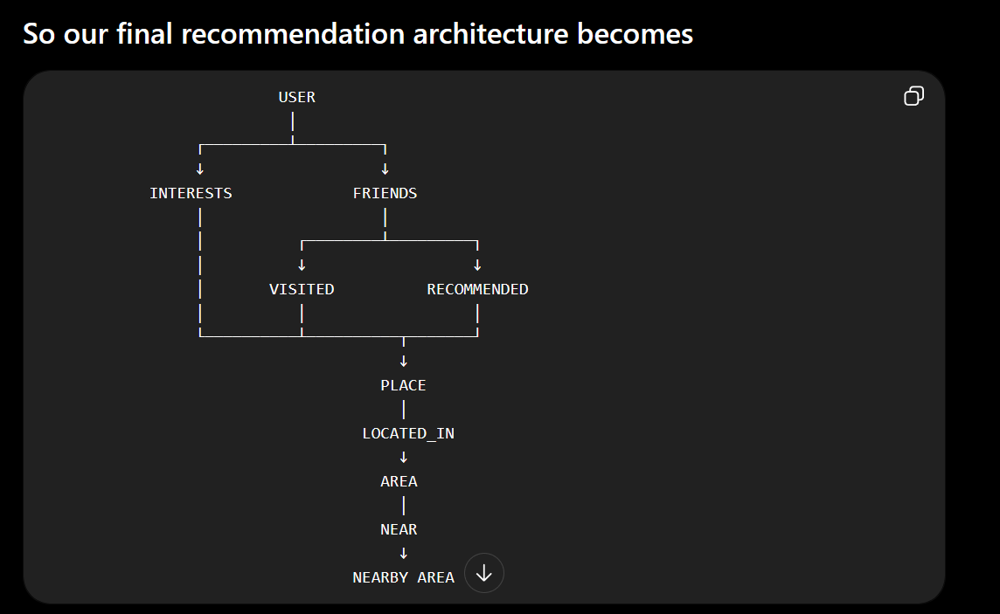

# Explore — Graph-Based Local Discovery

> A map-first place discovery app where your social graph and interests drive every recommendation.

**Live demo:** _[https://map-graph-9bixsmdic-vaishakhnambiars-projects.vercel.app/explore](https://map-graph-9bixsmdic-vaishakhnambiars-projects.vercel.app/explore)_

---

## What is this?

Most discovery apps answer: *"What places exist near me?"*

Explore asks a different question:

> **"Which places make sense for me — considering where my friends go, what I like, and what's happening in my neighbourhood?"**

That's a fundamentally relationship-heavy question. The answer lives in a graph, not a table.

A recommendation here might depend on a chain like:

```
You
 ↓ LIKES
Coffee
 ↑ HAS_ATTRIBUTE
Place
 ↑ VISITED
Your friend Rahul
```

Or an indirect signal:

```
Your friend Aisha
 ↓ VISITED
Place in Koramangala
 ↓ (area near)
HSR Layout ← the area you're browsing
```

These are relationship traversals. A graph database makes them natural to express, query, and explain.

---

## The Demo

Four demo users — **Arjun, Rahul, Priya, Aisha** — each have a different social graph, different interests, and different visit history. The graph contains 10 users in total; four are exposed in the UI for convenient demonstration. Same area, same map, completely different recommendation context.

**The key demo moment:** Recommend a place as Arjun → switch to Rahul (who is connected to Arjun) → see Arjun's recommendation appear as a social signal in Rahul's results.

This is a live graph mutation becoming future recommendation context. Not a database write that disappears into a void — a relationship that propagates through the graph and changes what another user sees.

---

## Features

| Feature | Description |
|---|---|
| 🗺️ Map-first UX | The map is not a background visualization — it is the primary interaction surface. Selecting a recommendation flies the map to the place, and selecting a marker opens its graph-backed explanation. |
| 📍 834 real places | Actual OpenStreetMap data from HSR Layout and Koramangala, Bangalore |
| 👥 Social graph | Friends' visits and recommendations influence your results |
| ❤️ Interest matching | Interests align with real place attributes from OSM data |
| 🔍 Three discovery modes | *For You*, *Friends*, and *Discover* — same graph, different scoring weights |
| 🔗 Explainable graph | Every recommendation opens an interactive graph showing exactly which relationships drove it |
| 💾 Live graph mutations | Save, Visit, and Recommend write relationships to the graph. Visit and Recommend affect future recommendation signals |
| 👤 Multi-user demo | Switch between users to see how the same area looks through different social contexts |
| 📊 Progressive loading | Recommendations load 5 at a time — no map overload |

---

## Why a Graph Database?

This is the honest answer: **SQL or NoSQL could implement this**. The reason for choosing a graph is that the recommendation context is relationship-heavy and multi-hop. We need to traverse users, friends, interests, visits, explicit recommendations, and geographic relationships — and then explain why each place was selected.

In a relational model, these relationships would typically require joins across multiple tables, with additional complexity as the traversal becomes multi-hop. The social recommendation logic combines several relationship paths across users, places, interests, and geographic areas:

1. User → interests
2. User → friends (via `CONNECTED_TO`)
3. Friends → places they visited
4. Friends → places they recommended
5. Places → areas they're in
6. Areas → nearby areas
7. Friends → places in nearby areas

In Cypher, this traversal reads like the data structure itself.

More importantly, the graph makes **explanation** natural. The same graph signals retrieved by the traversal are used both for scoring and for generating the explanation: *"Rahul visited this place. Matches your Coffee interest."*

### Why not ML?

For this assessment, deterministic and explainable scoring is more defensible than a learned ranking model. Each recommendation can be explained using the graph evidence and place signals that contributed to it — without relying on opaque model weights. A learned ranking model could replace or augment the scoring layer later, once enough real behavioral data accumulates.

---

## What Makes This Original

This is not a standard restaurant-recommendation app with a graph attached to it.

The differentiation comes from combining all of these simultaneously:

- **Real geography** — 834 actual OSM places, not invented data
- **Personal interest matching** — normalized against the user's actual interest count
- **Direct social evidence** — friends who visited or explicitly recommended the exact place
- **Indirect geographic context** — friends active in a nearby area (treated honestly as context, never as direct evidence)
- **Explainable multi-hop reasoning** — recommendations expose the relevant graph relationships and signals behind them
- **Live graph mutations** — user actions write relationships to the graph; Visit and Recommend become future social recommendation signals, while Save is preserved as personal intent for future use.
- **Mode-specific scoring policy** — same signals, different weights, genuinely different rankings

---

## Graph Data Model

### Nodes

| Node | What it represents |
|---|---|
| `User` | A person with interests, friends, and place history |
| `Place` | A real-world venue from OSM data |
| `Interest` | A preference like *Coffee*, *Outdoors*, or *Aesthetic* |
| `Attribute` | A semantic characteristic of a place |
| `Category` | A classification like *cafe*, *restaurant*, *park* |
| `Area` | A geographic region like HSR Layout or Koramangala |

### Relationships

| Relationship | Meaning | Signal type |
|---|---|---|
| `LIKES` | User has an interest | Personal preference |
| `CONNECTED_TO` | User is connected to another user | Social graph |
| `VISITED` | User visited a place | Activity / history |
| `RECOMMENDED` | User explicitly recommended a place | Intentional social signal |
| `SAVED` | User saved a place | Personal intent |
| `HAS_ATTRIBUTE` | Place has a characteristic | Semantic matching |
| `HAS_CATEGORY` | Place belongs to a category | Classification |
| `LOCATED_IN` | Place belongs to an area | Geographic context |
| `NEAR` | Area is near another area | Indirect geographic context |

### Graph structure

```
(:User)-[:LIKES]->(:Interest)
(:User)-[:CONNECTED_TO]->(:User)
(:User)-[:VISITED]->(:Place)
(:User)-[:RECOMMENDED]->(:Place)
(:User)-[:SAVED]->(:Place)
(:Place)-[:HAS_ATTRIBUTE]->(:Attribute)
(:Place)-[:HAS_CATEGORY]->(:Category)
(:Place)-[:LOCATED_IN]->(:Area)
(:Area)-[:NEAR]->(:Area)
```

The geographic chain — `Place → LOCATED_IN → Area → NEAR → Nearby Area` — is what enables indirect social signals. A friend visiting a place in a nearby area is meaningfully different from a friend visiting the exact recommended place. The code respects this distinction in both scoring and explanation.

---

## Recommendation Architecture

The pipeline is deliberately split into two layers.

```
CognoDB / Cypher
      ↓
Graph signals (facts retrieved from the graph)
      ↓
TypeScript scoring engine
      ↓
Mode-specific 100-point score
      ↓
Human-readable reasons
      ↓
Rank and return top 50
      ↓
Progressive frontend display (5 at a time)
```

**Cypher retrieves graph facts.** TypeScript decides recommendation policy.

This keeps the two concerns separate. The Cypher query doesn't know about modes or weights. The TypeScript scorer doesn't touch the graph.

### The recommendation query

The following is a simplified version of the production query used in `src/lib/queries.ts`, with repetitive projections condensed for readability. Non-essential projections and intermediate variables are omitted below; this is an architectural excerpt, not copy-pasteable Cypher.

```cypher
// 1. User context
MATCH (u:User {id: $userId})
MATCH (selectedArea:Area {id: $areaId})
OPTIONAL MATCH (u)-[:LIKES]->(userInterest:Interest)
WITH u, selectedArea, collect(DISTINCT userInterest.name) AS userInterests
OPTIONAL MATCH (u)-[:CONNECTED_TO]->(userFriend:User)
WITH u, selectedArea, userInterests, collect(DISTINCT userFriend.name) AS friendNames

// 2. Places in selected area
MATCH (p:Place)-[:LOCATED_IN]->(area:Area)
WHERE area = selectedArea

// 3. Interest ↔ attribute matching
OPTIONAL MATCH (p)-[:HAS_ATTRIBUTE]->(attribute:Attribute)
WITH ..., [x IN userInterests WHERE x IN placeAttributes] AS matchedInterests

// 4. Direct friend visits to this exact place
OPTIONAL MATCH (u)-[:CONNECTED_TO]->(friend:User)-[:VISITED]->(p)
WITH ..., collect(DISTINCT friend.name) AS visitors

// 5. Direct friend recommendations of this exact place
OPTIONAL MATCH (u)-[:CONNECTED_TO]->(friend2:User)-[:RECOMMENDED]->(p)
WITH ..., collect(DISTINCT friend2.name) AS recommenders

// 6. Indirect: friends active in a nearby area (NOT this place)
OPTIONAL MATCH (u)-[:CONNECTED_TO]->(nearbyFriend:User)
  -[:VISITED]->(nearbyPlace:Place)
  -[:LOCATED_IN]->(nearbyArea:Area)
WHERE (selectedArea)-[:NEAR]->(nearbyArea) AND nearbyArea.id <> $areaId
WITH ..., collect(DISTINCT nearbyFriend.name) AS nearbyVisitors

// Return raw signals — no score computed here
RETURN p.id, p.name, p.rating, matchedInterests,
       size(userInterests) AS totalUserInterests,
       visitors, recommenders, nearbyVisitors, nearbyAreas
```

The query returns raw graph signals. The TypeScript scoring layer (`src/lib/recommendations.ts`) receives these and applies the mode-specific 100-point model.

---

## Recommendation Modes

All three modes use the same graph signals. What changes is how the 100 available points are allocated.

**Why 100?** The total is not a cap applied after summing an unlimited raw score. It is constructed from bounded category maxima that add up to exactly 100. This makes the model interpretable: you can look at any recommendation and see how much each signal category contributed, on a fixed scale.

### For You — *Your interests + your social graph*

| Signal | Max points |
|---|---|
| Interest match | 35 |
| Friend visits | 25 |
| Friend recommendations | 25 |
| Nearby activity | 10 |
| Place quality | 5 |

### Friends — *What people in your network are actually doing*

| Signal | Max points |
|---|---|
| Friend visits | 35 |
| Friend recommendations | 35 |
| Nearby activity | 15 |
| Interest match | 10 |
| Place quality | 5 |

### Discover — *Explore the area, not just your social circle*

| Signal | Max points |
|---|---|
| Place quality | 35 |
| Interest match | 25 |
| Nearby activity | 15 |
| Exploration bonus* | 15 |
| Friend visits | 5 |
| Friend recommendations | 5 |

*The exploration bonus rewards places with **no direct social evidence**. It gives Discover a reason to surface genuinely new places rather than repeating what For You already surfaces:

```
0 direct social signals → +15
1 direct social signal  → +8
2+ direct signals       → +0
```

### Scoring is bounded, not capped

Social signals use saturation rather than linear accumulation:

```
0 friends visiting → 0% of category
1 friend           → 60%
2 friends          → 80%
3+ friends         → 100%
```

This prevents a user with a large friend group from dominating results purely through volume. Signal quality matters more than signal count.

Interest matching is normalized against the user's own interest count:

```
interestScore = min(matchedInterests / totalUserInterests, 1) × categoryMax
```

A user with two interests who matches both gets the same interest score as a user with ten interests who matches all ten. The proportion of matched interests is what matters, not the raw count.

---

## Explainability — Three Layers

Every recommendation is explainable at three levels.

**Layer 1 — The tray card**
A quick human-readable reason for clicking:
```
Arjun visited this place · Matches your Coffee interest
```

**Layer 2 — The selected place panel**
Richer context: friend avatars, relationship type, available actions.

**Layer 3 — The graph overlay**
An interactive graph visualization showing exactly which nodes and relationships contributed to the recommendation. Draggable, zoomable, pan-able. Not the full database — only the subgraph relevant to this specific recommendation.

---

## Screenshots

**1. Area exploration and progressive loading**


**2. Graph-backed place explanation**


**3. Interactive graph relationship view**


*(Architecture reference)*
**Recommendation architecture**


---

## Data

**Geographic data:** Real OpenStreetMap places extracted via the Overpass API.

```
834 places total
  HSR Layout: 321
  Koramangala: 513
```

**Social data:** Simulated — the assessment provides no real social interaction dataset. Controlled simulation makes the recommendation behavior deterministic and the demo reproducible.

```
10 users · 26 connections · 2,213 visits · 730 recommendations · 629 saves
```

The social graph is intentionally sparse and overlapping so different demo users produce genuinely different recommendation contexts.

---

## Project Structure

```
src/
├── app/
│   ├── api/
│   │   ├── recommendations/
│   │   │   └── route.ts        ← GET  — graph traversal + scoring
│   │   └── places/
│   │       └── action/
│   │           └── route.ts    ← POST — save / visit / recommend (MERGE)
│   ├── explore/
│   │   └── page.tsx            ← main application (map + tray + graph overlay)
│   └── login/
│       └── page.tsx            ← demo user selector
│
├── components/
│   └── ExploreMap.tsx          ← MapLibre map, markers, area overview
│
└── lib/
    ├── db.ts                   ← CognoDB driver init
    ├── queries.ts              ← Cypher queries
    └── recommendations.ts      ← scoring + ranking + explanation logic

scripts/
├── seed-social.ts              ← safe — creates social graph around existing places
├── seed.ts                     ← ⚠️  destructive — resets the database
├── import-osm.ts               ← OSM data ingestion
├── ingest-osm.ts               ← OSM data processing
└── osm-places.json             ← local OSM place dataset
```

---

## Running Locally

**Prerequisites:** Node.js 20+, a CognoDB instance with the graph already seeded (see Setup below).

```bash
# Clone the repo
git clone https://github.com/Vaishakh-Nambiar/Your-map.git
cd Your-map

# Install dependencies
npm install

# Configure environment
cp .env.example .env
# Edit .env and add your CognoDB credentials

# Verify the database connection
npm run db:test

# Start the dev server
npm run dev
```

Open `http://localhost:3000`

---

## Environment Variables

Copy `.env.example` to `.env` and fill in your CognoDB credentials:

```bash
COGNO_DB_URI=bolt+s://your-database-id.databases.cognodb.com
COGNO_DB_USERNAME=cognodb
COGNO_DB_PWD=your-database-password
COGNO_DB_INSTANCEID=your-database-id
```

Credentials are accessed only from server-side API routes. They are never exposed to the browser.

---

## Database Setup (CognoDB)

1. Create a CognoDB instance at [cognodb.com](https://cognodb.com)
2. Copy the connection details to your `.env`
3. Import the OSM place data:
   ```bash
   npx tsx scripts/ingest-osm.ts
   ```
4. Seed the social graph:
   ```bash
   npm run db:seed
   ```
   This runs `scripts/seed-social.ts`, which creates users, interests, friend connections, visits, recommendations, and saves around the existing OSM places.

> **⚠️ Do not run `scripts/seed.ts` directly.** It is destructive and resets the entire database.

---

## Tech Stack

| Layer | Technology |
|---|---|
| Framework | Next.js 16.3.1 (App Router) |
| Language | TypeScript |
| Styling | Tailwind CSS v4 |
| Map | MapLibre GL JS 5.23.0 |
| Map tiles | OpenFreeMap Liberty |
| Place data | OpenStreetMap / Overpass API |
| Database | CognoDB (Neo4j-compatible) |
| Driver | `neo4j-driver` v6 |
| Runtime | Node.js 20 |

---

## API Reference

### `GET /api/recommendations`

Returns ranked place recommendations for a user in a given area and mode.

```
/api/recommendations?userId=u1&areaId=area1&mode=for-you
```

| Param | Values |
|---|---|
| `userId` | demo users exposed in the UI: `u1`–`u4` |
| `areaId` | `area1` (HSR Layout) · `area2` (Koramangala) |
| `mode` | `for-you` · `friends` · `discover` |

Returns up to 50 ranked recommendations, each with score, reasons, visitor names, and matched interests.

### `POST /api/places/action`

## User Actions and Graph Consequences

Users can independently perform three actions on any place:

| Action | Graph relationship | Recommendation signal? |
|---|---|---|
| **Save** | `(User)-[:SAVED]->(Place)` | ❌ Not a scoring signal in the current model. Writes to graph for future use. |
| **Visit** | `(User)-[:VISITED]->(Place)` | ✅ Appears as a `visitors` signal for connected users |
| **Recommend** | `(User)-[:RECOMMENDED]->(Place)` | ✅ Appears as a `recommenders` signal — an explicit social endorsement |

All three actions use `MERGE` (idempotent). Multiple actions can coexist for the same place.

`SAVED` exists in the graph data model and is preserved for future use — it is not yet wired into the scoring model.

---

## Demo Walk-Through

This is the sequence that demonstrates the full graph-backed recommendation loop:

1. **Open the app** — select a user from the login screen (try Arjun first)
2. **Pick an area** — click HSR Layout or Koramangala on the map
3. **See For You recommendations** — personalized by Arjun's interests and friend activity
4. **Click a recommendation card** — see the explanation panel and friend activity
5. **Click "View graph connections"** — see the interactive graph showing exactly which relationships drove this recommendation
6. **Switch mode** — Friends → see social signals dominate; Discover → see quality and exploration surface new places
7. **Mark a place as Recommend** — this writes `(Arjun)-[:RECOMMENDED]->(Place)` to the graph
8. **Switch to Rahul** (who is connected to Arjun) — reload HSR Layout, check For You
9. **Arjun's recommendation now appears as a social signal in Rahul's results** — this is the live graph mutation becoming recommendation context

---

## Known Tradeoffs

**Recommendation latency (~9s).** The current graph traversal query takes around 9 seconds on the CognoDB free tier. An optimization attempt caused timeouts reaching 66–67s, so the working query was retained. Query optimization is intentionally deferred post-MVP.

**Simulated social data.** The assessment provides no real social interaction dataset. Seeded data is used to make the demo reproducible and the recommendation behavior deterministic.

**No visited-place filtering.** Visited places are not automatically excluded from future recommendations. An attempt to add a `NOT VISITED` filter to the candidate query caused the result set to return empty — the constraint was removed for the MVP. Visit actions write to the graph and become social signals for connected users, but do not currently suppress the visited place from the visitor's own results.

**Demo authentication only.** User switching uses `localStorage` — not real auth. This is appropriate for an assessment demo and explicitly flagged in the UI.

---

## Future Work

- Recommendation query optimization (query planner, index tuning)
- Temporal signals (recency of visits and recommendations)
- Feedback loops (visited → reduce recency weight, not exclude)
- More geographic areas
- Real user authentication
- Production caching layer
- Richer place profiles (hours, price level, photos)
- Learned ranking layer (once behavioral data exists)

---

## Assessment Requirement Mapping

The Wexa AI assignment specifies explicit requirements. This table maps each one to the implementation:

| Requirement | Implementation |
|---|---|
| Graph data model with labeled nodes and typed relationships | 6 node types, 9 relationship types — see Graph Data Model section |
| Real or realistic data | 834 real OSM places; social data is simulated and stated honestly |
| Multi-hop Cypher (2+ hops required) | Multiple multi-hop traversals including User → Friend → Place → Area → Nearby Area |
| Parameterized queries, no string concatenation | `$userId`, `$areaId` parameters; no template literal Cypher |
| Environment-based credentials | `COGNO_DB_URI`, `COGNO_DB_USERNAME`, `COGNO_DB_PWD` — never in browser |
| Working hosted application | _[Live Demo Link](https://map-graph-9bixsmdic-vaishakhnambiars-projects.vercel.app/explore)_ |
| Source code in repository | Full source — queries, scoring, seed scripts, all included |
| Data-loading scripts | `scripts/seed-social.ts`, `scripts/ingest-osm.ts` |
| README with setup/run instructions | This document |
| Graph data model diagram | `Relationships.png`, graph structure in this README |
| Explanation of main queries | See Recommendation Architecture and Cypher query sections |
| Loading / empty / error states | All three present in `explore/page.tsx` |
| Graceful database failure handling | API returns error response; UI shows error state |

The CognoDB instance remains live for evaluation.
